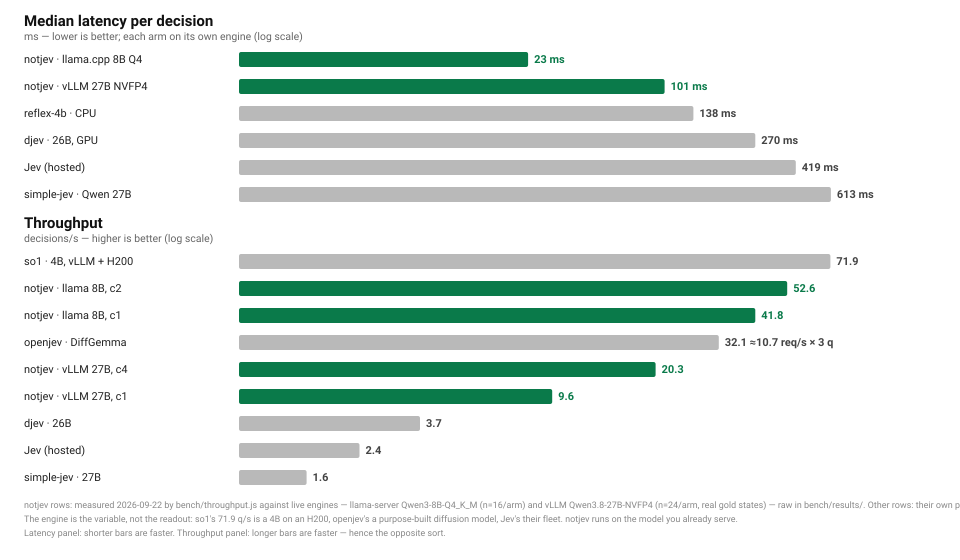
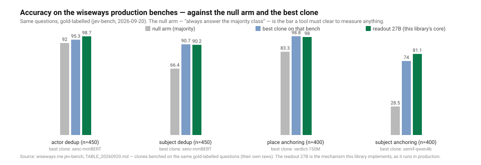

# notjev

[](https://www.npmjs.com/package/notjev)
[](https://github.com/9pings/notjev/actions/workflows/ci.yml)
[](https://nodejs.org/)
[](LICENSE)

**Read the decision out of the distribution, instead of making the model write it.**

A closed question — "same or other?", "which of these 12 categories?", "1 to 5?" — does not need a
generated answer. The server already exposes the distribution of the next token. Present the options
as `A.`, `B.`, … ask for **one** token with `logprobs: true`, keep the mass of the letter tokens,
renormalise, and you get a verdict **and a probability** — therefore a margin, therefore an
abstention you can tune.

One HTTP request. `max_tokens: 1`. ~70 ms on a local 27B. No runtime dependency, no Python, no
tokenizer, no model download: it works against anything that speaks OpenAI `chat/completions` with
logprobs (vLLM, llama.cpp, Ollama, OpenAI, …).

```
                 state + question + A./B./C. menu
                                  |
                        one chat/completions call
                     max_tokens 1 · logprobs · top 20
                                  |
   top_logprobs:  " A" -0.39   "B" -1.14   "Based" -8.33   "The" -8.39  …
                                  |
       keep A/B → renormalise → p1 0.68  p2 0.32  margin 0.36  coverage 0.98
                                  |
                  margin >= theta ? verdict : UNDECIDED
```

## Why not just ask it to answer

Because a generated answer gives you a word and nothing else. This gives you:

* a **probability** on the verdict (`p1`) and a **margin** (`p1 - p2`);
* an **abstention** that is a threshold you sweep, not a "cannot tell" option in the menu
  (an offered door gets taken: measured at 1/1000 when offered, while the margin is tunable at will);
* a **coverage** number that tells you when the model wanted to say something else entirely;
* a decision object small enough to **record and replay offline** — re-tune theta on last week's run
  without touching a GPU.

## Install

```sh
npm install notjev      # or: git clone … && npm link
```

Node >= 20 (native `fetch`). No dependencies.

## Quickstart

```js
const { createClient } = require('notjev');

// NOTJEV_BASE_URL, NOTJEV_MODEL, NOTJEV_API_KEY, NOTJEV_THETA
const jev = createClient();

(async () => {
  const r = await jev.decide({
    state   : 'A: "Sarah Knafo"\nB: "Sarah Knafot" (seen in an audio transcript)\n',
    question: 'verdict',
    options : ['SAME', 'OTHER'],
    theta   : 0.5,
  });

  console.log(r.choice, r.p1.toFixed(3), r.margin.toFixed(3), r.band, r.coverage.toFixed(3));
  // e.g.  null 0.500 0.000 med 0.983   <- a 27B, exactly torn on this pair: no verdict at theta 0.5
  if (r.undecided) console.log('no verdict:', r.explain());
})();
```

Explicit configuration, when you do not want env vars:

```js
const { createClient } = require('notjev');

const jev = createClient({
  baseUrl    : process.env.NOTJEV_BASE_URL,   // e.g. 'http://127.0.0.1:8000'
  model      : process.env.NOTJEV_MODEL,      // e.g. 'Qwen3-27B'
  apiKey     : process.env.NOTJEV_API_KEY,    // optional
  theta      : 0.5,                           // margin under which nothing is decided
  topLogprobs: 20,
  timeoutMs  : 60000,
  retries    : 2,
});

(async () => {
  console.log(jev.prompt({ state: 'x\n', question: 'verdict', options: ['SAME', 'OTHER'] }));
})();
```

`jev.prompt(q)` builds the exact string **without sending anything**. Read it before theorising
about the model: it is the first rung of every diagnosis.

## The three question forms

```js
const { createClient } = require('notjev');
const jev = createClient();

(async () => {
  // 1. a closed list — the codes come back as `choice`, in YOUR order
  const a = await jev.decide({
    state   : 'The minister announced a plan on Tuesday.\n',
    question: 'event type',
    options : [
      { id: 'ANNOUNCE', description: 'someone makes something public' },
      { id: 'MEET',     description: 'two parties meet' },
      { id: 'VOTE',     description: 'a ballot is held' },
    ],
    theta: 0.3,
  });
  console.log(a.choice, a.value, a.byOption);

  // 2. a boolean — YOU provide the two options, in your language, or not at all
  const b = await jev.noul('The minister announced a plan.\n', 'is this about policy?',
    { yes: 'YES', no: 'NO' });
  console.log(b.value, b.p1.toFixed(3));   // true 0.97

  // 3. a scale — read on the digits, with the expectation over the whole distribution
  const c = await jev.score('The minister announced a plan.\n', 'how concrete is it?', { min: 1, max: 5 });
  console.log(c.value, c.expectation && c.expectation.toFixed(2));
})();
```

N questions on one state — one request each, so each one is still one token. The server's prefix
cache makes the shared state nearly free:

```js
const { createClient } = require('notjev');
const jev = createClient();

(async () => {
  const rows = await jev.decideMany('The minister announced a plan on Tuesday.\n', [
    { id: 'kind',   question: 'event type', options: ['ANNOUNCE', 'MEET', 'VOTE'] },
    { id: 'policy', question: 'is this about policy?', noul: { yes: 'YES', no: 'NO' } },
    { id: 'depth',  question: 'how concrete is it?', score: 5 },
  ], { concurrency: 1 });

  for (const r of rows) console.log(r.id, r.choice, r.p1.toFixed(3), r.band, r.undecided);
})();
```

## What comes back

| field | what it is |
|---|---|
| `choice` | the code, or **`null`** — `null` is not a fallback, it is the absence of a verdict |
| `value` | the re-typed answer: the code, a boolean (`noul`), an integer (`score`) |
| `expectation` | `score` only: the mean grade under the whole distribution |
| `top` | what the model would have said without the margin — readable, never applied |
| `p1`, `p2`, `margin` | on the distribution **renormalised over the options** |
| `band` | `low` < 0.5 <= `med` < 0.75 <= `high` < 0.9 <= `certain` |
| `prior` | the **middle of the band** — what stays true across engines, unlike the raw float |
| `coverage` | the option mass **before** renormalisation. Low = the model meant something else |
| `exactMass` / `spacedMass` | `"A"` vs `" A"`, counted apart so the matching rule is auditable |
| `degraded` | `true` when no option letter appeared at all. Then `choice` is `null`, always |
| `undecided` | `margin < theta`, or degraded |
| `probabilities`, `byOption` | sums to 1 over the options |
| `prompt`, `request`, `raw`, `readoutRaw` | the exact string, the exact body, the server response, and the distribution as a one-line JSON for your logs |
| `ms`, `usage`, `model` | the call itself |

## theta, bands, coverage — how to actually use them

* **theta is not a constant, it is a curve.** Record a set of questions with a truth column, then
  read `coverage x precision` and pick the point you can afford. `0.5` is a default, not an answer.
* **Never write `p1` as if it were a measurement.** Between two engines serving the same weights,
  2.3-10.4 % of verdicts differ — but 0-0.1 % among those at `p1 >= 0.9`. Store `band`/`prior`.
* **`coverage` is your smoke alarm.** A run whose mean coverage drifts down is a run whose prompt no
  longer fits the model: the mass went somewhere outside your menu.
* **`degraded` is never "it hesitates".** It means the answer was not in your codomain at all.

## What it needs, what it buys, what it costs

**It needs a model, loaded and reachable — and that is the whole deployment story.** This library
does no inference: it needs an OpenAI-compatible server (vLLM, llama.cpp, Ollama, an API) that
returns `logprobs`, with weights already in memory. There is nothing to train and nothing to
download here, but there is an engine to run.

**It is the SAME model as the rest of your stack — that is the point, not a concession.** The
weights that answer your chat sessions are the weights that decide: one engine serves both paths
against the same weights, with nothing extra in VRAM and no second deployment. notjev is the fast
**System 1** read on that model (one token, ~70 ms, a probability); the same server's
`/v1/chat/completions` is the **System 2** answer (generation, reasoning, as many tokens as the
case deserves). Escalation is a route change, not a stack change: decide first at one token, and
send to the same model, as a chat, the cases whose `margin` was not enough.

**What that buys:**

* a verdict **and** a probability, therefore a margin, therefore an abstention you tune as a curve
  (`theta`), not a plea for mercy from the model;
* a decision at the price of one prefill plus one token — and on `decideMany` the shared state is
  nearly free behind the server's prefix cache;
* no parsing, no schema, no repair loop: the answer is read off the distribution, so it cannot be
  hallucinated off-schema;
* a `coverage` smoke alarm for the runs where the model meant something else entirely;
* record-and-replay: re-tune `theta` on last week's run without touching a GPU.

**What it costs:**

* **one token is one thought.** The model cannot deliberate: a question that needs reasoning must
  go to the same server as a chat — that is the System 2 path above, it costs tokens, and notjev
  tells you exactly when to take it (the margin);
* the probabilities are **ordered, not calibrated** — measure the ECE on your own questions before
  writing `p1` anywhere (the `calibration` module is for that);
* the menu order is part of the measurement (5.6-17.7 % of flips on permutation) and the raw `p1`
  does not survive a change of engine — the `band` does;
* some providers return no logprobs (Anthropic's Messages API): there this cannot work, and it says
  so instead of guessing.

## Performance, measured



The engine is the variable, not the readout: every arm above runs the same mechanism (one pass, the
distribution read off) on ITS OWN model and hardware. All the notjev rows were measured on 2026-09-22
by `bench/throughput.js` (raws committed in `bench/results/`), on **real gold-labelled states**:

| engine | p50 | throughput |
|---|---|---|
| llama-server `Qwen3-8B-Q4_K_M` | **23 ms** | 41.8 q/s (c1) · 52.6 q/s (c2) |
| vLLM `Qwen3.8-27B-NVFP4` | **101 ms** | 9.6 q/s (c1) · 20.3 q/s (c4) |

For scale, on the same style of questions: hosted Jev measures at a **419 ms** median (an
independent same-questions bench of the hosted services, 2026-09-20), and so1's headline 71.9 q/s is
a 4B model on an H200 slice. One honest inversion we
measured ourselves and publish as-is: **on vLLM, `packed` is slower than reading one by one** (1.1 q/s
vs 9.6 on short states — extracting `prompt_logprobs` costs more than a cached-prefill one-token
read). so1 measured the same thing. `packed` saves tokens, not time, on an engine with a prefix
cache; it shines where states are long and questions share them, and on backends without a cache.

```sh
# reproduce against any llama-server or vllm instance — ~60 requests, deliberately not a load test
node bench/throughput.js --backend llama --base-url http://…:8000 --model Qwen3-8B-Q4_K_M --n 16 --concs 1,2 --packed 0 --raw bench/results/out.json
node scripts/figures.js   # regenerates the figure from the raw
```

## Measure it on your own questions

Record the responses while you run, replay them for free afterwards:

```js
const fs = require('fs');
const { createClient } = require('notjev');
const jev = createClient();

const questions = [
  { id: 'q1', options: ['SAME', 'OTHER'], gold: 'SAME',  state: 'A: "Sarah Knafo" / B: "Sarah Knafot"\n' },
  { id: 'q2', options: ['SAME', 'OTHER'], gold: 'OTHER', state: 'A: "Paris, France" / B: "Paris, Texas"\n' },
];

(async () => {
  const results = [];
  for (const q of questions) {
    const r = await jev.decide({ state: q.state, question: 'verdict', options: q.options, theta: 0 });
    results.push({ id: q.id, options: q.options, gold: q.gold, ms: r.ms, resp: r.raw });
  }
  fs.writeFileSync('run.json', JSON.stringify({ model: jev.model, results }, null, 1));
  console.log('recorded', results.length);
})();
```

```js
const fs = require('fs');
const { replay, report } = require('notjev');

const { rows } = replay(JSON.parse(fs.readFileSync('run.json', 'utf8')), { theta: 0, truth: 'gold' });
const rep = report(rows, { positive: 'SAME' });

console.log('accuracy', rep.accuracy.accuracy, 'null arm', rep.accuracy.nullArm.accuracy);
console.log('ECE', rep.ece.ece);
for (const s of rep.sweep) console.log('theta', s.theta, 'coverage', s.coverage, 'precision', s.precision);
```

`report` never gives you an accuracy alone: the **null arm** (always answer the majority class) and
the **oracle arm** come with it. A bar the null arm already clears measures nothing.

## The modules

The core reads one question at a time, over HTTP, against a chat endpoint. Seven modules sit around
it, each one paid for by a measurement of the 2026-09-20/21 campaign. They all speak the same shape
— `entries = [{token, logprob}]` per position read, then `distribution`, then `decide` — and none of
them renormalises anything in silence.

| module | what it adds | the number behind it |
|---|---|---|
| `packed` | several questions on ONE state, in one pass | 0.911 agreement vs 0.900 read one by one, ~2.2x cheaper |
| `backends/llama-server` | GGUF via `/completion` + `n_probs` | same prompt byte for byte as vLLM; 0.935 vs 0.947 |
| `backends/node-llama-cpp` | native Node readout, packed by positions, no server | `controlledEvaluate` marks arbitrary positions |
| `tokenizer` | the instrument checks, before any number | 17 IPTC codes share their first token — that regime is REFUSED |
| `calibration` | temperature fitted on a declared split | ECE 0.121 -> 0.051 (8B), 0.035 -> 0.017 (27B) |
| `harness` | permutation, A/B swap, strata, null arms, flips | 17.7 % of verdicts flip when the menu is reshuffled |
| `set` | a coordinate as a SET of active nodes | exact-set 0.692 / Jaccard 0.817, against a null arm at 0.291 |
| `logits` | entries straight from pruned logits | `lse` missing -> `coverage: null`, never 1 |
| `contract` | the JSONL form the scorer reads | a missing field refuses BEFORE the GPU is spent |
| `wire` | the Jev `/v1/systemone` contract, translated | a `typesafe-sdk` works unchanged; >26 options = `422`, never truncated |

**Packed** — one state, k questions, one forward pass. The prompt is a chain of alternating turns
whose assistant turns carry a fixed placeholder (`_`, never the model's own answer); the
distribution that predicted that placeholder IS the answer to the question above it. The positions
are located by incremental tokenisation and then **verified**: a misalignment refuses (`PACKED_MISALIGNED`)
rather than returning a perfectly plausible, perfectly wrong distribution.

```js
const { packed } = require('notjev');

// In production, inject the server's tokenizer:
//   const tokenize = require('notjev/tokenizer').makeHttpTokenizer({ baseUrl, kind: 'llama-server' });
// Here, a toy one (1 char = 1 token) so this example runs with no server at all.
const tokenize = async (s) => [...s].map((c) => c.charCodeAt(0));

(async () => {
  const p = await packed.buildPacked({
    state: 'Nikon FM2 — 1982, manual focus, mechanical shutter to 1/4000.',
    tokenize,
    questions: [
      { id: 'focus', question: 'focusing', options: ['manual', 'autofocus'] },
      { id: 'meter', question: 'metering', options: ['none', 'centre-weighted', 'matrix'] },
    ],
  });
  console.log(p.positions.length, 'slots,', p.nTokens, 'tokens, one state written once');
  // Then: POST /v1/completions with { prompt: p.prompt, max_tokens: 1, prompt_logprobs: 20 }
  // and packed.readPacked(resp, p) gives one decision per question.
})();
```

**Calibration** — a temperature is fitted on a CALIB split and published with it. Applying a `T`
fitted elsewhere is a transfer, and says so (`split`).

```js
const { calibration } = require('notjev');

// 100 readouts that all said 0.95, right 70 times: over-confident.
const rows = [];
for (let i = 0; i < 100; i++) rows.push({ probabilities: [0.95, 0.05], label: i < 70 ? 0 : 1 });

const fit = calibration.fitTemperature(rows, { split: 'calib-2026-09' });
console.log('T', fit.T.toFixed(2), 'ECE', fit.eceBefore.toFixed(3), '->', fit.eceAfter.toFixed(3), 'split', fit.split);
```

**Harness** — nothing is published without a null arm on the same measurand, and every perturbation
is seeded, therefore replayable.

```js
const { harness } = require('notjev');

const a = [{ id: 1, top: 'x' }, { id: 2, top: 'y' }, { id: 3, top: 'z' }];
const b = [{ id: 1, top: 'x' }, { id: 2, top: 'q' }, { id: 3, top: 'z' }];
console.log('flips', harness.flips(a, b));                 // { n: 3, flips: 1, rate: 0.333... }

const perm = harness.permute({ question: 'which one', options: ['x', 'y', 'z'] }, 7);
console.log('menu reshuffled', perm.question.options, 'order', perm.order);
```

**Set** — a coordinate is a SET of active nodes: one Choice per division, plus a Noul asking whether
the division applies at all. The band is a **reliability cursor per node**, never what constitutes
the set: tightening to `p1 >= 0.9` raised per-node precision to 0.90 and dropped the exact-set from
0.692 to 0.565. So a cursor REMOVES nodes (into `undecided`), it never adds any.

```js
const { set } = require('notjev');

const r = set.readSet({ divisions: [
  { id: 'focusing',  poles: ['manual', 'autofocus'],        probabilities: [0.97, 0.03] },
  { id: 'metering',  poles: ['none', 'centre', 'matrix'],   probabilities: [0.10, 0.52, 0.38] },
  { id: 'flash',     poles: ['none', 'built-in'],           probabilities: [0.80, 0.20], applies: 0.2 },
] });
console.log('active', r.active.map((n) => n.node + ' (' + n.band + ')'));
console.log('skipped', r.skipped.map((s) => s.division));   // the Noul said the division does not apply
```

## The JSONL contract

Three implementations already run on this measurand (this library, a Python pruning probe, the
campaign clones). What makes them comparable is not their code, it is one line shape — validated by
`notjev/contract`, which refuses **before** the GPU is spent rather than at scoring time.

An INPUT line carries `{ id, kind, options }` plus **either** `{ state, question }` (the library
renders the string) **or** `content` — the string already rendered, taken byte for byte. That second
door exists for probes that must replay their own recorded prompt exactly.

An OUTPUT line carries `id, choice, p1, p2, margin, band, prior, coverage, exactMass, spacedMass,
degraded, undecided, theta, probabilities`, and optionally `value`, `expectation`, `prompt_sha256`,
`backend`, `model`, `source` (`'http'` or `'logits'`) and `layer`. **`coverage` must be present**, and
`null` is a legal value: it says "this path cannot compute it" (pruned logits with no `lse`). Absent,
it would read as "all was well"; written as `1`, it would claim nothing was said outside the menu.

```js
const { contract, readResponse } = require('notjev');

contract.validateInput({ id: 'q1', kind: 'choice', state: 'A vs B', question: 'verdict',
  options: ['SAME', 'OTHER'] });

const resp = { choices: [{ logprobs: { content: [{ token: 'A', logprob: -0.05,
  top_logprobs: [{ token: 'A', logprob: -0.05 }, { token: 'B', logprob: -3.5 }] }] } }] };
const row = Object.assign({ id: 'q1' }, readResponse(resp, { options: ['SAME', 'OTHER'], theta: 0.5 }), {
  prompt_sha256: contract.sha256('the exact prompt that was sent'),
  backend: 'vllm', model: 'my-model', source: 'http',
});
contract.validateOutput(row);
console.log('contract ok —', row.choice, row.band, 'coverage', row.coverage.toFixed(4));
```

## Use cases

* **A judge with a closed codomain** — anywhere a model is asked to pick one label out of a list you
  own. You get the verdict, the margin, and an abstention you can price.
* **Entity anchoring / deduplication** — "is this the same unit as one of these?". `theta = 0` merges
  100 % of NEW entities by mistake; the margin is the product, not the verdict.
* **Structured extraction of a coordinate** — several attributes of one object in a single pass
  (`packed` + `set`): the state is written once, the questions cost one forward pass together.
* **Grading and confidence** — `score` returns the expectation over the whole scale, not just the
  top grade; `band` is what survives a change of engine.
* **Measuring a prompt change** — `harness` permutes the menu, swaps the A/B blocks, stratifies and
  runs the null arms; `calibration` says what the probabilities are worth on a declared split.
* **Not**: free generation, open-ended answers, or anything whose codomain you cannot write down.
  There the distribution of ONE token says nothing, and this library refuses to pretend otherwise.

## CLI

```bash
notjev prompt --state 'A: "Sarah Knafo" / B: "Sarah Knafot"' --question verdict \
  --option SAME --option OTHER

notjev decide --state 'A: "Sarah Knafo" / B: "Sarah Knafot"' --question verdict \
  --option 'SAME=one and the same entity' --option 'OTHER=two distinct entities' \
  --theta 0.5 --json

notjev noul --state 'The minister announced a plan.' --question 'is this about policy?' \
  --yes YES --no NO
```

`--state` takes a file path, a literal string, or `-` for stdin. Exit codes: **0** a verdict,
**3** UNDECIDED, **4** DEGRADED, **1** an error — so a shell can tell "it said SAME" from "it said
nothing".

Replay a recording, with no server at all:

```bash
notjev replay run.json --truth gold --theta 0 --positive SAME
```

## As a service

```bash
notjev serve --port 8787 &
until curl -sf localhost:8787/health >/dev/null; do sleep 0.2; done

curl -s localhost:8787/v1/decide -H 'content-type: application/json' -d '{
  "state": "The minister announced a plan on Tuesday.\n",
  "theta": 0.5,
  "questions": [
    { "id": "kind",   "question": "event type",          "options": ["ANNOUNCE", "MEET", "VOTE"] },
    { "id": "policy", "question": "is this about policy?", "noul": { "yes": "YES", "no": "NO" } },
    { "id": "depth",  "question": "how concrete is it?",   "score": 5 }
  ]
}'

kill %1
```

One state, N questions, typed answers — the native route: it claims compatibility with nothing.

## The Jev wire contract — `POST /v1/systemone`

The same server also speaks the one-endpoint contract of TypeSafe's Jev and of the OpenJev
ecosystem, so a `typesafe-sdk` (or anything that speaks it) pointed at this server works unchanged —
against ANY OpenAI-compatible engine you configure:

```bash
notjev serve --port 8788 &        # same process: /v1/decide AND /v1/systemone
until curl -sf localhost:8788/health >/dev/null; do sleep 0.2; done

curl -s localhost:8788/v1/systemone -H 'content-type: application/json' -d '{
  "state": "The minister announced a plan on Tuesday.",
  "questions": {
    "policy": { "type": "noul",   "instructions": "is this about policy?" },
    "kind":   { "type": "choice", "instructions": "event type",
                 "criteria": { "ANNOUNCE": "someone makes something public",
                               "MEET": "two parties meet", "VOTE": "a ballot is held" } }
  }
}'

kill %1
```

Answers come back grouped as `{ nouls, choices, scores }` with `confidence = 1 − H(p)/ln K`, `usage`
in Jev field names, `GET /v1/models` resolving `jev-latest`, and FastAPI-shaped `422` detail lists.
Every answer also carries a `notjev` block — `margin`, `band`, `coverage`, `degraded` — the
instrument fields the contract has no room for. Two things are REFUSED rather than degraded: a
choice with more than 26 options (the letter regime; Jev allows 255) comes back `422` with a named
reason, never a truncated menu; and an upstream failure is a `502` for the whole request, never
half-filled answers. An optional `apiKey` on `createServer` turns the POST routes into
bearer-guarded ones (`NOTJEV_API_KEY=sk-… notjev serve`).

## Server quickstarts

**vLLM** — logprobs are on by default; a thinking model needs the template switch, which this
library sends by default (`chat_template_kwargs: {enable_thinking: false}`).

```sh
vllm serve <model> --max-model-len 32768 --max-num-seqs 4
export NOTJEV_BASE_URL=http://127.0.0.1:8000 NOTJEV_MODEL=<model>
```

**llama.cpp** — `llama-server` returns chat logprobs since PR #10783; check your build.

```sh
llama-server -m model.gguf --port 8080
export NOTJEV_BASE_URL=http://127.0.0.1:8080 NOTJEV_MODEL=whatever
```

**Ollama** — logprobs on `/v1/chat/completions` landed in 0.12.11; older versions silently return
none, which this library reports as `degraded: true` rather than as a hesitation.

```sh
export NOTJEV_BASE_URL=http://127.0.0.1:11434 NOTJEV_MODEL=qwen3:8b
```

**OpenAI** — remove the template switch, it rejects unknown body fields:

```sh
export NOTJEV_BASE_URL=https://api.openai.com NOTJEV_MODEL=gpt-4.1-mini NOTJEV_API_KEY=sk-…
notjev decide --no-template-kwargs --state 'x' --question q --option A1 --option B1
```

(in code: `createClient({ templateKwargs: null })`; some models also want
`extra: { max_completion_tokens: 1 }` instead of `max_tokens`.)

## What is measured, and where

These numbers come from a **production judge** — a real editorial pipeline where this readout decides
entity matches, anchorings and event types on live traffic (170k recorded calls, 5 089 distinct
questions), campaign of **2026-09-20**, 27B model served by vLLM (NVFP4) and by llama.cpp (GGUF),
on that pipeline's own judge questions — they are quoted here as provenance, not as a promise about
your questions:

| measurement | value |
|---|---|
| agreement with the generating (grammar-constrained) arm, n = 1224 | **0.947** (vLLM), 0.935 (GGUF) |
| null arm on the same set ("always the majority class") | 0.693 |
| raw ECE, 10 buckets | **0.090** |
| latency | **70 ms**/question (vLLM), 290 ms (GGUF) |
| flips when the two options are swapped | 6.5 % |
| verdicts that differ between engines | 2.3-10.4 % overall, **0-0.1 % at p1 >= 0.9** |
| cost of permuting the menu | 5.6 % of flips (2 options), 17.7 % (near-identical labels) |
| space variants (`" A"` vs `"A"`) | <= 0.08 % of coverage |
| abstention at theta = 0.5 on an entity-matching bench | precision 0.927, correct abstention 0.716 |
| the same bench at theta = 0 | 100 % of new entities wrongly merged |

And one measurement made *with this library*, 2026-09-21, replaying the recorded 48-question set
(`--truth gold`) and then re-asking 3 of those questions live on a **different** vLLM instance of the
same model:

| measurement | value |
|---|---|
| replay of the recording, agreement with the human truth | 0.896 (43/48), null arm 0.563, ECE 0.065 |
| the same rows at theta = 0.5 | coverage 79.2 %, precision **100 %** (5 errors out of 5 removed) |
| live re-ask, same verdict as the recording | **3/3** |
| live re-ask, same band as the recording | **3/3** |
| live re-ask, movement of the raw `p1` | up to **0.179** |



Which is the whole argument for the band, measured twice: the verdict and the band survived a
different server, the float did not.

The exact string this library sends is fingerprinted against that campaign
(`test/fixtures/campaign-turns.json`): if one byte of the envelope moves, `npm test` fails and the
numbers above stop applying. That test is the point of the fixture.

## Limits

* **26 options maximum.** One letter, one token. Beyond that, split the question.
* **`checkBoundary` takes the TEMPLATED prompt** (assistant turn open, `chatml.render(..., { thinkingOff: true })`), never the bare user content — on the bare content it refuses (`ANSWER_BOUNDARY`) although the real readout is fine (measured in vivo 21/09, `docs/verifications/`).
* **One letter must be one token** on your tokenizer. It is on every tokenizer used here, but check
  before you trust a new model family.
* **The probabilities are not calibrated.** They are *ordered*, which is enough for a margin and for
  bands; they are not a frequency until you measure the ECE on your own questions.
* **`top_logprobs` is capped** (20 on most servers). With 26 options and a flat model, the tail can
  fall outside the top-k: `coverage` tells you when that happens.
* **No native boolean.** `noul` is two options that you name; the library has no idea what "yes"
  means in any language, and that is deliberate.
* **The prompt weighs more than the engine** (0.833 vs 0.733 on layout alone, same model). Changing
  `instruction`, the option order, or adding descriptions is a new experiment, not a setting.
* **A thinking model must have thinking off**, or the first token is `<think>` and coverage is 0.

## What this is not

* not a classifier — there is no training, no head, no threshold learned on your data;
* not a calibrated probability service — it gives you the tools to measure your own calibration;
* not a guardrail or a judge with an opinion — the codomain, the wording and the order are yours;
* not a way to make a small model right; it is a way to know **how sure** a model is, cheaply, and
  to **not act** when it is not sure.

## Decisions taken in this implementation

Design calls that the source material did not settle, resolved here in favour of long-term
flexibility, and written down so they can be argued with:

1. **`lib/readout.js` is a faithful port** of the module that runs in that production judge
   (same constants, same layout, same refusals, same band/snap arithmetic — 8018 differential
   comparisons, 0 divergence). Only the parts tied to that host were dropped (its calibration store
   and the key helper), and the measurement helpers moved to `lib/metrics.js`.
2. **A degraded readout never decides.** `readout.decide` only knows the margin, and an empty
   distribution has margin 0 — at `theta: 0` it would return the first option. The client layer
   therefore forces `undecided` when `degraded`. `top` stays readable; the verdict does not exist.
3. **Options may carry a description** (`{ id, description }` renders `id: description`) and the
   returned `choice` is always the `id`. A description changes the prompt, hence the measurement —
   the README says so rather than the library forbidding it.
4. **`chat_template_kwargs` is sent by default** (that is the measured body) and removed on request
   with `templateKwargs: null`, instead of being opt-in. Being faithful to the measured call is the
   default; adapting to a stricter server is one word.
5. **Metric rows are `{ p1, margin, choice, expected }`**, with `correct` derived when absent. The
   source harness used its own field names; the library keeps one language-neutral shape.
6. **`replay` and `notjev replay` ship with the library**, not as an example. Re-reading a recorded
   run offline is the main reason the reading is pure; leaving it out would have made the purity
   decorative.
7. **`prompt` / `body` are public.** Reading the exact string costs nothing and is the first rung of
   every diagnosis.
8. **Exit codes 3 and 4** for UNDECIDED and DEGRADED, so a shell cannot mistake an abstention for a
   verdict.
9. **Apache-2.0, revisable** — the owner settled the licence on 21/09; published as `notjev` on npm
   (public access), source at `github.com/9pings/notjev`.

## En français, en bref

La lecture de décision : on présente les options `A.`, `B.`, …, on demande **un** token avec
`logprobs`, on garde la masse des lettres, on renormalise. On obtient un verdict **et** une
probabilité, donc une marge (`p1 - p2`), donc une abstention réglable (`theta`) — et un `coverage`
qui dit quand le modèle voulait répondre autre chose. `UNDECIDED` n'écrit rien : la question reste
pendante et se re-pose quand l'état change. Le point `p1` n'est pas portable d'un moteur à l'autre,
la **bande** l'est : on range `p1` dans `low/med/high/certain` et on écrit le milieu de bande
(`prior`). Aucune liste de mots d'une langue ne vit dans la bibliothèque : les options, leurs
descriptions et la question viennent de l'appelant, toujours — `noul()` prend donc ses deux options
en argument. Les chiffres cités viennent d'une campagne de mesure en production du 20/09/2026
(27B, vLLM), et l'empreinte sha256 de la chaîne envoyée est testée contre cette campagne : si un octet de
l'enveloppe bouge, `npm test` tombe et les chiffres ne s'appliquent plus.

## Tests


```sh
npm test      # node --test: the pure reading, the client against a real socket, the CLI, the README
npm run lint  # node --check on every file
```

CI runs `npm run lint` and `npm test` on Node 20 and 22 (`.github/workflows/ci.yml`), and
`npm publish` runs them again through `prepublishOnly` — a published version is a tested one.

Every negative control in the suite is **named**: it states which sabotage it detects (a trimmed
state, a permuted menu, a token outside the codomain, a margin under theta, a retried 400, a
recording without logprobs). A green suite that cannot fail proves nothing.
